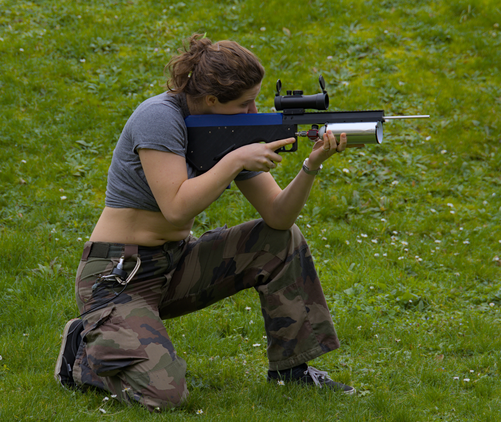
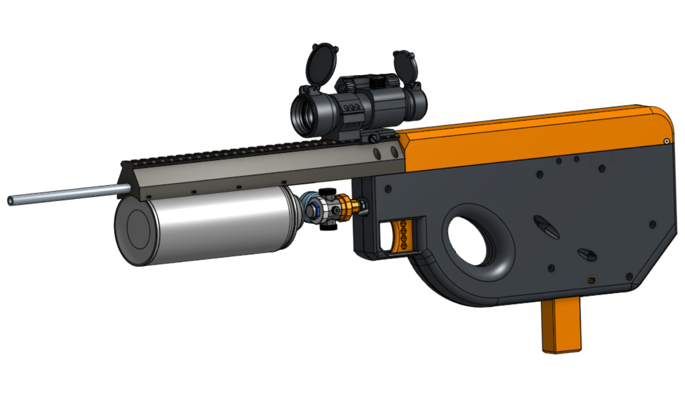
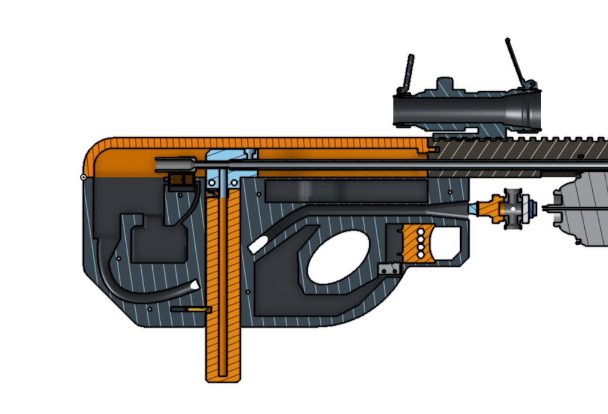
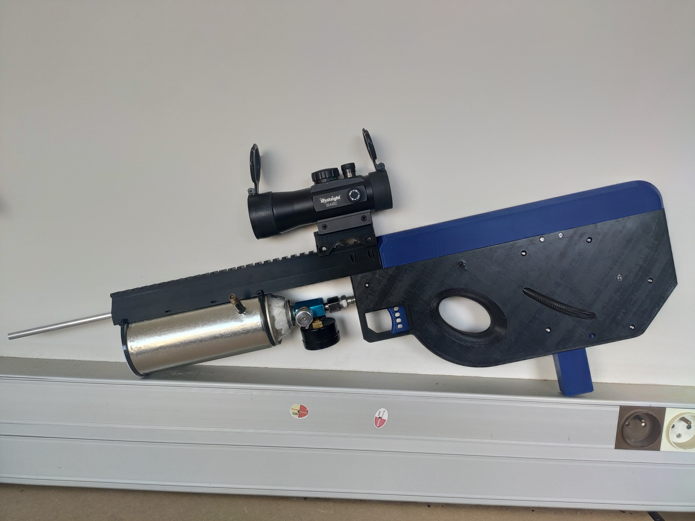

# DIY-PCP-airsoft

Cheap and powerful DIY airsoft gun

 

 

I tried to build the cheapest airsoft gun without sacrificing power and accuracy. Also without using any off the shelf airsoft parts. The power source is a paint can pumped to a 10bar max pressure with a bike pump. It make the build cheap to run as the only consumables are the bb's.

The air is delivered to the hop-up unit by a solenoid valve. The automatic reloading after each shot is managed by a small servo. The brain of all this is an Arduino Nano wich has three switch connected to it : trigger switch hidden inside, safety switch, fire mode switch

 

 

 

Everything is powered by a 18650 cell and a buck-boost converter

 

The magasine can hold 25 bb and a full tank of air will last me 3 magazines. I know that it cannot compete whith a high end airsoft replica but i'm very happy of the results. It has a great accuracy, more power than needed and it can be built for less than 50€ !!!!

You'll find here all the 3D files, the bill of materials, the wiring diagram and the code.

I took inspiration from this \[project](https://github.com/AlexGyver/EnglishProjects/tree/master/GyverGun)

